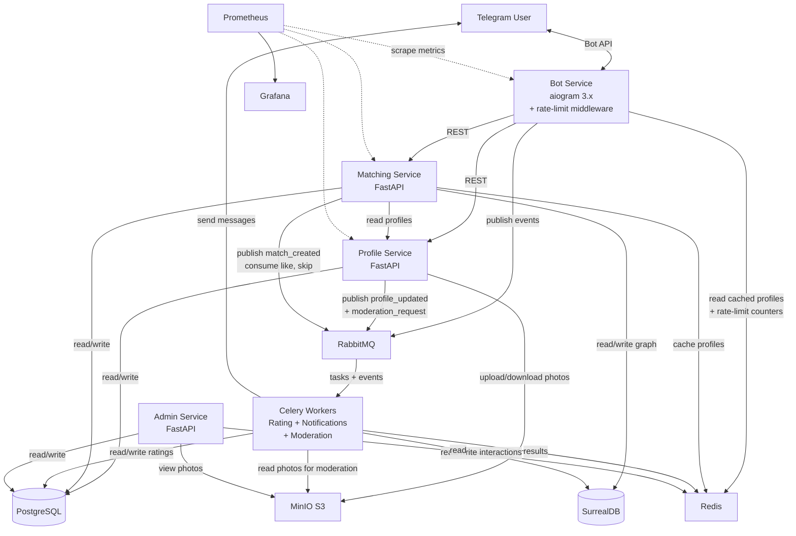
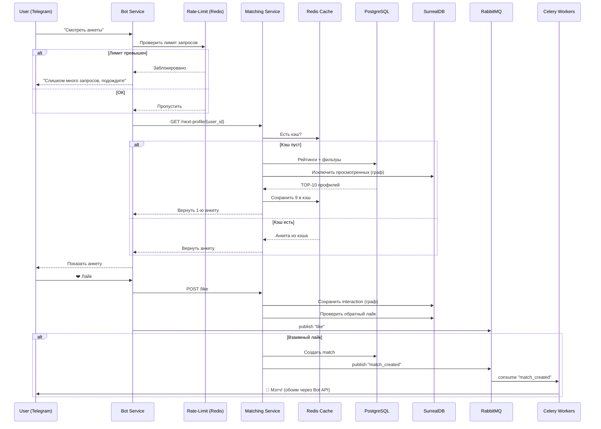
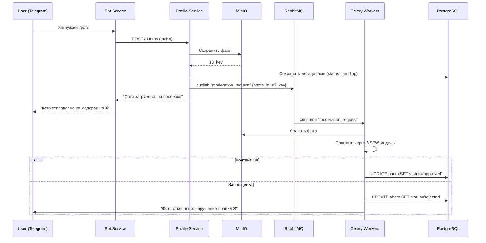
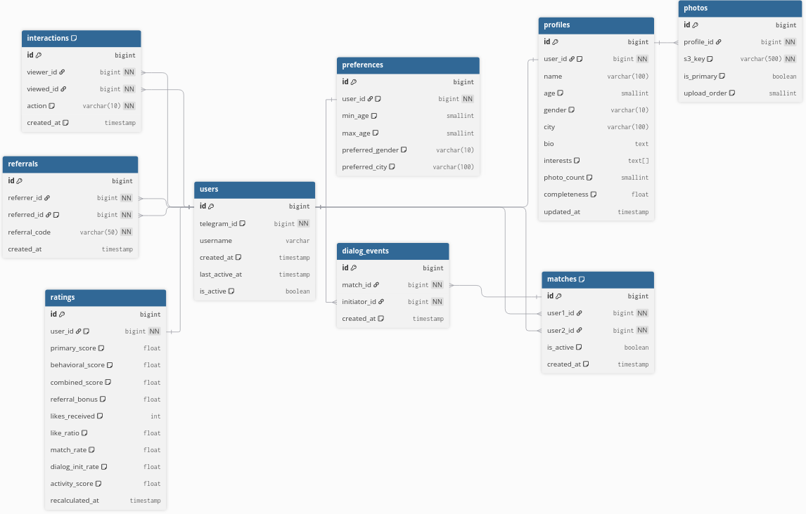

# Этап 1: Планирование и проектирование

## 1. Описание сервисов

### Bot Service
- **Назначение:** Точка входа пользователя, весь интерфейс через Telegram

- **Что делает:** Принимает команду `/start` (регистрация + главное меню),
  через inline-кнопки — просмотр/редактирование анкеты, 
  листание анкет других пользователей, лайки/пропуски, 
  список мэтчей, реферальные ссылки
  
- **Дополнительно:** Rate-limit мидлварь — защита от спама и DDoS (ограничение запросов на пользователя через Redis)
- **Общается с:** Profile Service (REST), Matching Service (REST), RabbitMQ (кидает события), Redis (читает закэшированные анкеты + счётчики rate-limit), MinIO (забирает фото)

### Profile Service
- **Назначение:** Всё, что связано с анкетой пользователя
- **Что делает:** Создание/редактирование/удаление анкет, валидация данных, подсчёт полноты профиля, работа с фотографиями (хранит метаданные, файлы в MinIO), реферальная система
- **Дополнительно:** При загрузке фото/текста отправляет задачу на модерацию в Celery
- **Общается с:** PostgreSQL, MinIO (S3), RabbitMQ (кидает `profile_updated`, `moderation_request`)

### Matching Service
- **Назначение:** Подбор анкет, лайки, мэтчи
- **Что делает:** Отдаёт следующую анкету (фильтрует по предпочтениям, сортирует по рейтингу, исключает уже просмотренных), обрабатывает лайки/пропуски, определяет мэтч (взаимный лайк), заранее загружает пачку из 10 анкет в Redis
- **Общается с:** Profile Service (REST), PostgreSQL, Redis, RabbitMQ

### Celery Workers (Рейтинг + Уведомления + Модерация)
- **Назначение:** Все фоновые задачи в одном месте
- **Что делает:**
  - **Рейтинг:** Celery Beat раз в 30 минут запускает пересчёт всех трёх уровней рейтинга, результаты пишет в таблицу `ratings`
  - **Уведомления:** Слушает событие `match_created` из RabbitMQ и шлёт обоим пользователям сообщение через Telegram Bot API. Также по расписанию напоминает неактивным пользователям о боте
  - **Модерация контента:** Проверяет загруженные фото и текст анкеты нейросетью на запрещённый контент. Если контент не проходит — анкета блокируется, пользователю приходит уведомление
- **Почему вместе:** Все задачи фоновые и асинхронные, Celery разводит их по разным очередям внутри одного воркера
- **Общается с:** RabbitMQ (брокер), PostgreSQL (чтение/запись), Redis (result backend), Telegram Bot API (отправка сообщений), MinIO (забирает фото для проверки)

### Admin Service
- **Назначение:** Панель администратора для управления ботом
- **Что делает:** Просмотр/бан пользователей, ручная модерация анкет (очередь на проверку), статистика (количество пользователей, мэтчей, активность), управление заблокированными аккаунтами, просмотр логов модерации
- **Общается с:** PostgreSQL (чтение/запись), Redis (статистика), MinIO (просмотр фото)

---

## 2. Основные технологии

| Технология | Где используется | Зачем |
|---|---|---|
| **Python, aiogram 3.x** | Bot Service | Асинхронная библиотека для работы с Telegram Bot API — без неё бота не сделать |
| **Python, FastAPI** | Profile Service, Matching Service, Admin Service | REST API для общения между сервисами. Асинхронный, с автоматической валидацией через Pydantic |
| **PostgreSQL** | Основная БД | Нужны связи между таблицами (пользователь → анкета → фото), транзакции (при создании мэтча), сложные выборки с фильтрами и сортировкой |
| **SurrealDB** | Хранение графа взаимодействий | Interactions и matches — это по сути граф отношений между пользователями. В реляционной БД запросы типа "найди всех, кого лайкнул A, кто при этом лайкнул B" — тяжёлые JOIN'ы. В графовой/документной БД такие связи хранятся и обходятся нативно. SurrealDB совмещает документную и графовую модели, поддерживает SQL-подобный синтаксис |
| **Redis** | Кэш анкет, rate-limit, result backend Celery | Кэш: Matching Service один раз достаёт 10 анкет и кладёт в Redis, 9 свайпов отдаются мгновенно. Rate-limit: счётчик запросов на пользователя с TTL — если превысил лимит, бот не отвечает. Без Redis пришлось бы хранить счётчики в памяти (не переживает рестарт) или в PostgreSQL (слишком медленно для каждого запроса) |
| **Celery + Celery Beat** | Celery Workers | Пересчёт рейтингов — агрегация по всем лайкам, мэтчам, диалогам. Модерация — прогон через нейросеть. Делать это синхронно нереально. Celery Beat запускает пересчёт раз в 30 минут, модерация выполняется по событию |
| **RabbitMQ** | Брокер сообщений + брокер Celery | Лайк → сохранить interaction → проверить мэтч → уведомить. Без очереди пришлось бы вызывать сервисы цепочкой синхронно — медленно и ненадёжно. Также брокер для Celery |
| **MinIO (S3)** | Хранение фото | Фото в PostgreSQL — раздувает БД. На файловой системе — не масштабируется. MinIO — self-hosted S3 |
| **Модель модерации (transformers / NSFW-detector)** | Celery Workers | Нужно автоматически проверять фото и текст на запрещёнку. Без этого модерация только ручная — не масштабируется. Используем готовые модели (например, `falconsai/nsfw_image_detection` для фото, text classification для текста) |
| **Rate-limit middleware** | Bot Service | Защита от DDoS и спама. Пользователь может слать десятки запросов в секунду — без ограничения бот ляжет. Мидлварь считает запросы через Redis (INCR + EXPIRE), при превышении лимита — игнорирует |
| **Prometheus + Grafana** | Метрики | Без метрик не понять, что происходит под нагрузкой: сколько анкет в секунду отдаётся, какой hit rate у кэша, растут ли очереди |
| **Structured logging** | Логирование | Логи в JSON с контекстом (user_id, request_id, имя сервиса). Когда запрос проходит через 3 сервиса, обычным `print` баг не отловишь |
| **Docker + Docker Compose** | Контейнеризация | 5 своих сервисов + PostgreSQL + SurrealDB + Redis + RabbitMQ + MinIO + Prometheus + Grafana — без контейнеров не поднять |
| **GitHub Actions** | CI/CD | Автоматический прогон линтера и тестов при пуше, сборка Docker-образов |

---

## 3. Архитектурная схема



### Поток: просмотр анкеты → лайк → мэтч



### Поток: загрузка фото → модерация



---

## 4. Схема данных

### PostgreSQL (реляционные данные)



### SurrealDB (граф взаимодействий)

```
Структура графа:

Узлы (nodes):
  user:{telegram_id}  — пользователь

Рёбра (edges):
  liked    — user:A -[liked]-> user:B     (timestamp)
  skipped  — user:A -[skipped]-> user:B   (timestamp)
  viewed   — user:A -[viewed]-> user:B    (timestamp)
  matched  — user:A -[matched]-> user:B   (timestamp, is_active)

Примеры запросов:
  — Кого лайкнул пользователь:
    SELECT ->liked->user FROM user:123

  — Взаимный лайк (мэтч):
    SELECT * FROM liked WHERE in=user:B AND out=user:A

  — Исключить уже просмотренных:
    SELECT ->viewed->user, ->liked->user, ->skipped->user FROM user:123
```

---

### Описание ключевых таблиц

#### PostgreSQL

**`users`** — создаётся при первом `/start`. Главное поле — `telegram_id`. `last_active_at` нужен для поведенческого рейтинга и напоминаний неактивным. `is_banned` — для блокировки из админки.

**`profiles`** — анкета (1:1 с `users`). Всё, что видят другие: имя, возраст, пол, город, описание, интересы. `completeness` (0.0–1.0) пересчитывается при обновлении, используется в первичном рейтинге. `photo_count` — чтобы не JOIN'ить `photos` при расчёте рейтинга. `moderation_status` — прошла ли анкета проверку.

**`photos`** — метаданные фото. Файлы в MinIO, тут только `s3_key`. `is_primary` — главное фото. `status` — `pending` / `approved` / `rejected` (модерация нейросетью).

**`preferences`** — фильтры поиска (1:1 с `users`). Matching Service по ним решает, какие анкеты показывать. `preferred_city = NULL` — любой город.

**`matches`** — взаимные лайки. `user1_id < user2_id` — каноничный порядок, без дублей. `is_active` — можно размэтчить.

**`ratings`** — готовые рейтинги, пересчитанные Celery. Matching Service просто сортирует по `combined_score`. Хранит компоненты всех трёх уровней, чтобы было понятно, из чего сложился балл.

**`referrals`** — кто кого пригласил. `referred_id` уникален. Количество приглашённых влияет на `referral_bonus`.

**`moderation_log`** — лог проверок модерации. Что проверялось, результат, причина отказа. Нужен админке для просмотра истории.

#### SurrealDB

**Граф взаимодействий** — лайки, пропуски, просмотры хранятся как рёбра графа. Запрос "кого я уже видел" — обход графа от одного узла, а не `SELECT ... WHERE viewer_id = X` с индексами. Запрос "взаимный лайк" — проверка обратного ребра. Для Matching Service это быстрее и естественнее, чем JOIN'ы в PostgreSQL, особенно при росте данных.

**`dialog_events`** — кто первый написал после мэтча. Без этого нельзя посчитать `dialog_init_rate` — долю мэтчей, которые привели к реальному общению.