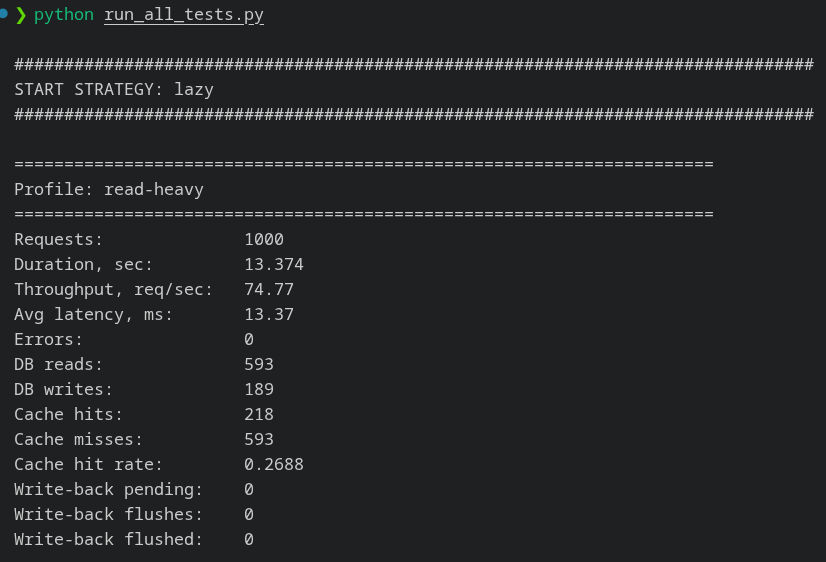
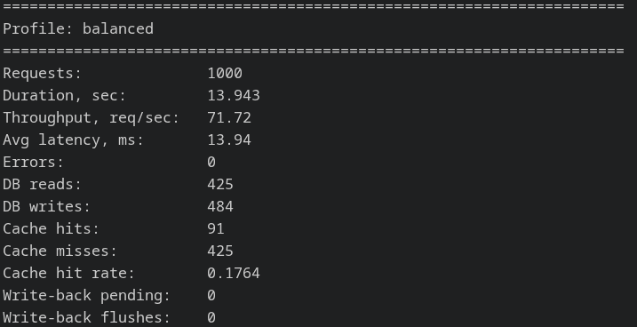
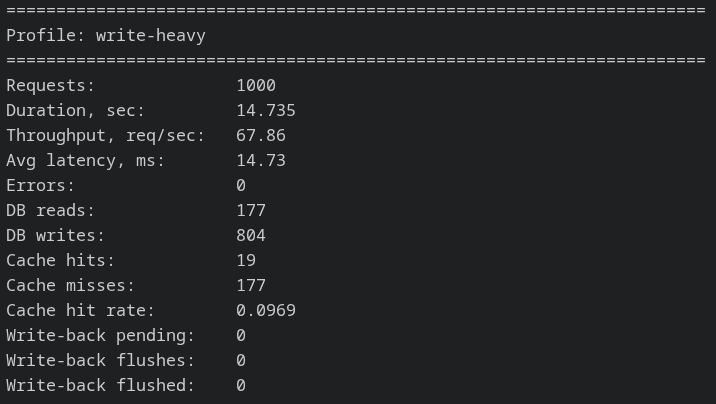
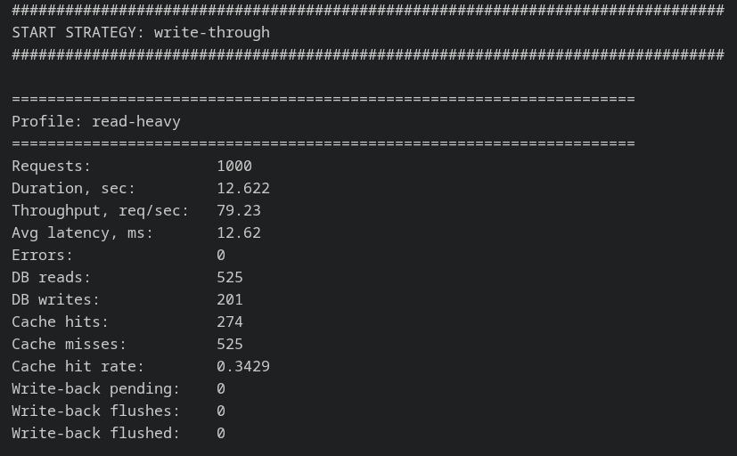
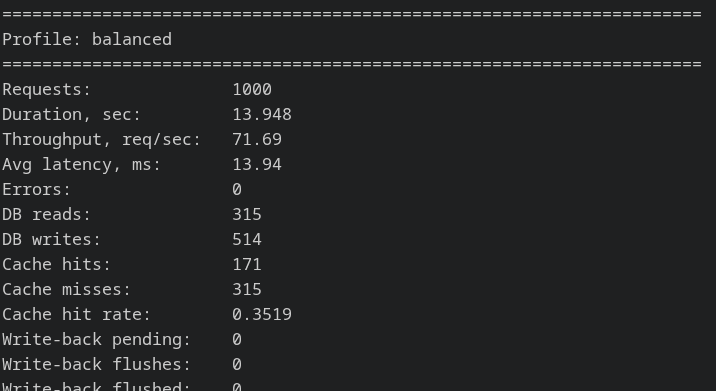
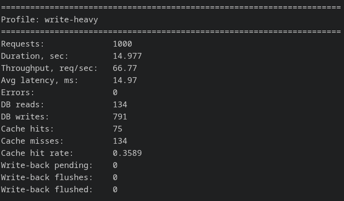
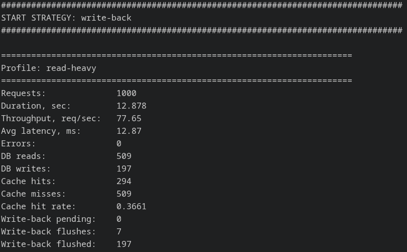
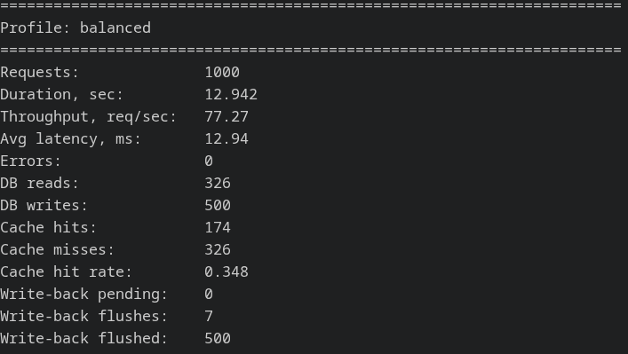
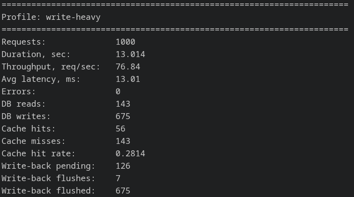
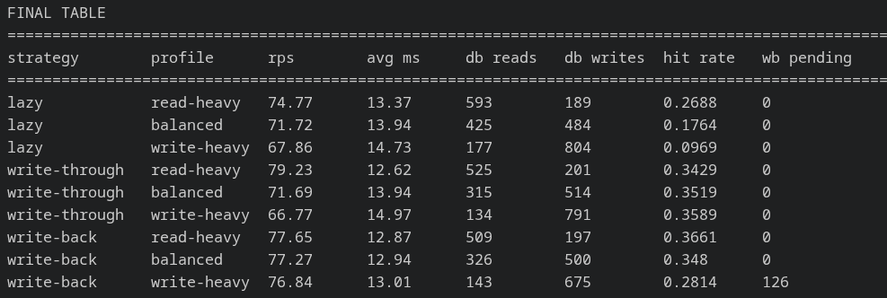

# Отчет: сравнение типов кеширования

## 1. Цель работы

Цель работы — реализовать и сравнить три стратегии кеширования в одинаковых условиях:

- Lazy Loading / Cache-Aside / Write-Around;
- Write-Through;
- Write-Back.

## 2. Состав системы

Система состоит из четырех частей:

- `load_generator.py` — генератор нагрузки;
- `app.py` — приложение;
- `Redis` — кеш;
- `SQLite` — база данных.

Во всех вариантах меняется только стратегия записи в кеш и БД.

## 3. Описание стратегий

### Lazy Loading / Cache-Aside / Write-Around

При чтении приложение сначала проверяет кеш. Если данных нет, они читаются из БД и записываются в кеш.

При записи данные сразу записываются в БД, а кеш очищается для этого ключа.

### Write-Through

При чтении приложение сначала проверяет кеш. Если данных нет, они читаются из БД и записываются в кеш.

При записи данные одновременно записываются в БД и в кеш.

### Write-Back

При чтении приложение сначала проверяет кеш. Если данных нет, они читаются из БД и записываются в кеш.

При записи данные сначала записываются в кеш, а в БД отправляются позже фоновым потоком.

## 4. Описание тестов

Для всех стратегий использовался один и тот же набор данных:

- 1000 записей в SQLite;
- 1000 запросов на каждый тест;
- один и тот же генератор нагрузки;
- Redis очищался перед каждым тестом.

Профили нагрузки:

| Профиль | Чтение | Запись |
|---|---:|---:|
| read-heavy | 80% | 20% |
| balanced | 50% | 50% |
| write-heavy | 20% | 80% |

## 5. Результаты

```table
==================================================================================================================================
strategy        profile      rps        avg ms     db reads   db writes  hit rate   wb pending
==================================================================================================================================
lazy            read-heavy   74.77      13.37      593        189        0.2688     0         
lazy            balanced     71.72      13.94      425        484        0.1764     0         
lazy            write-heavy  67.86      14.73      177        804        0.0969     0         
write-through   read-heavy   79.23      12.62      525        201        0.3429     0         
write-through   balanced     71.69      13.94      315        514        0.3519     0         
write-through   write-heavy  66.77      14.97      134        791        0.3589     0         
write-back      read-heavy   77.65      12.87      509        197        0.3661     0         
write-back      balanced     77.27      12.94      326        500        0.348      0         
write-back      write-heavy  76.84      13.01      143        675        0.2814     126       
```

## 6. Скриншоты

### Lazy Loading / Cache-Aside / Write-Around

#### Read-heavy



#### Balanced



#### Write-heavy



### Write-Through

#### Read-heavy



#### Balanced



#### Write-heavy



### Write-Back

#### Read-heavy



#### Balanced



#### Write-heavy



### Итоговая таблица




## 7. Выводы


Для нагрузки на чтение лучший результат по скорости показал Write-Through: на профиле read-heavy он достиг 79.23 req/
sec со средней задержкой 12.62 ms. При этом самый высокий cache hit rate на этом профиле был у Write-Back — 0.3661,
но по общей производительности он немного уступил Write-Through.

Для нагрузки на запись лучше всего подходит Write-Back. На профиле write-heavy он показал 76.84 req/sec и среднюю
задержку 13.01 ms, что заметно лучше, чем у Lazy и Write-Through. Это объясняется тем, что запись сначала попадает в
кеш, а в БД отправляется позже фоновым процессом.

Для смешанной нагрузки лучший результат также показал Write-Back: на профиле balanced он достиг 77.27 req/sec при
задержке 12.94 ms. Это лучший показатель throughput среди стратегий на смешанном профиле. Однако по hit rate на
balanced немного лучше оказался Write-Through: 0.3519 против 0.3480.

Lazy Loading оказался самым простым, но при увеличении количества записей его эффективность падает. На профиле write-
heavy cache hit rate составил всего 0.0969, потому что при записи данные пишутся в БД, а кеш для измененного ключа
очищается.

Главный минус Write-Back виден на профиле write-heavy: после теста осталось 126 записей в очереди на запись в БД. Это
показывает риск данной стратегии: при аварийном завершении приложения часть данных может не успеть сохраниться в
базе.

Итог: для чтения по скорости лучше всего показал себя Write-Through, для записи — Write-Back, для смешанной нагрузки
— тоже Write-Back. Если важна надежность и согласованность данных между кешем и БД, лучше использовать Write-Through.
Если важна максимальная производительность записи и допустима отложенная запись в БД, лучше использовать Write-Back.