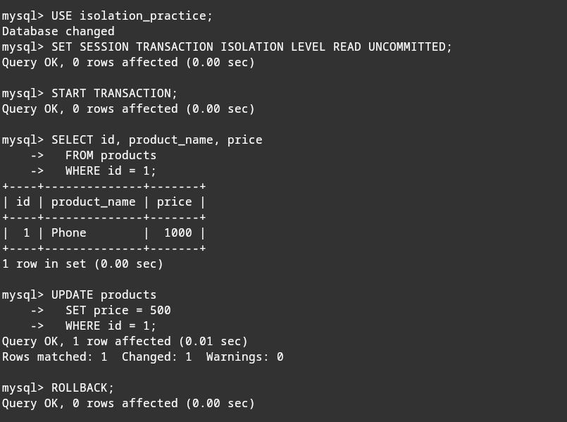
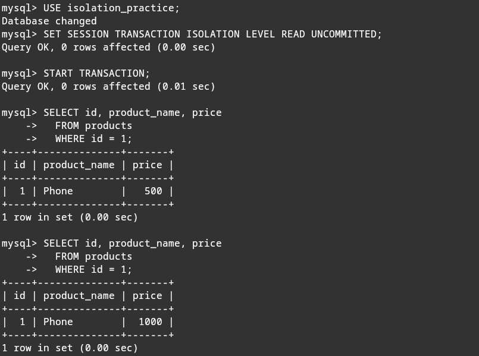
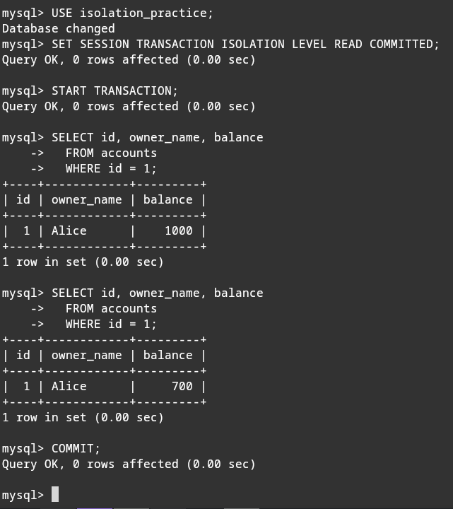
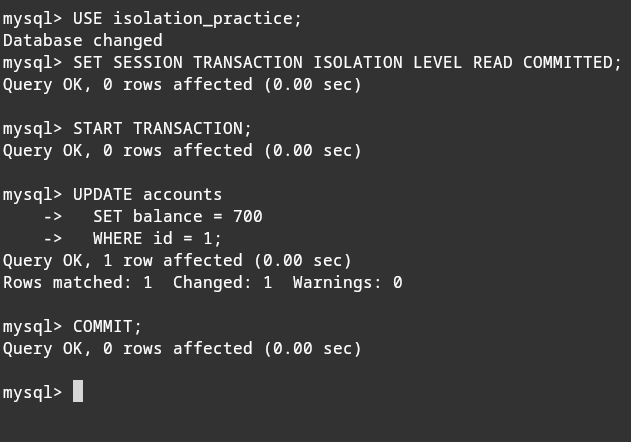
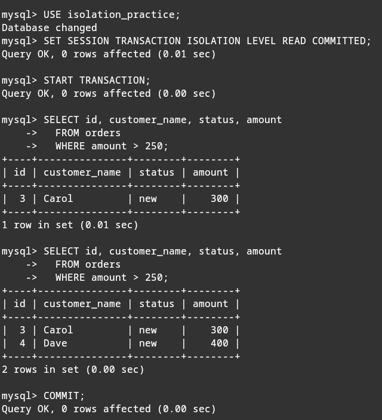
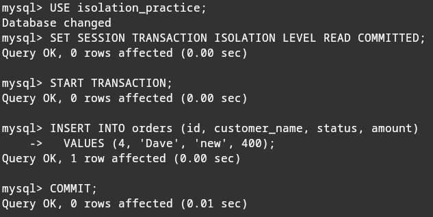
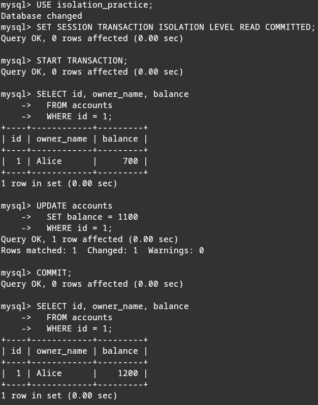
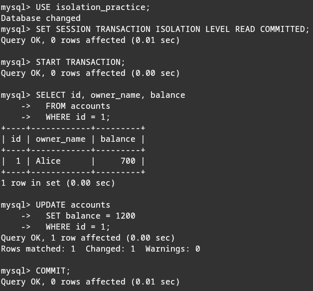

## Отчёт по выполнению практики "АНОМАЛИИ ИЗОЛЯЦИИ В SQL"

### Используемая БД

Для практики использовалась **MySQL 8.4.9 Community Server** в Docker.

База данных:

```sql
isolation_practice
```

Движок таблиц:

```sql
InnoDB
```

InnoDB выбран потому, что он поддерживает транзакции, уровни изоляции и блокировки строк. Это нужно для демонстрации аномалий изоляции.

### Подготовка базы данных

Для подготовки использовался SQL-скрипт `01_setup.sql`:

```sql
-- Practice database for SQL isolation anomalies.
-- The script is compatible with MySQL and MariaDB.

-- Recreate the database so the practice starts from the same state.
DROP DATABASE IF EXISTS isolation_practice;
CREATE DATABASE isolation_practice;
USE isolation_practice;

-- Accounts table: useful for balance-related examples.
-- It will be used for non-repeatable read and lost update.
CREATE TABLE accounts (
    id INT PRIMARY KEY,
    owner_name VARCHAR(50) NOT NULL,
    balance INT NOT NULL
) ENGINE=InnoDB;

-- Products table: useful for reading uncommitted price changes.
-- It will be used for dirty read.
CREATE TABLE products (
    id INT PRIMARY KEY,
    product_name VARCHAR(50) NOT NULL,
    price INT NOT NULL
) ENGINE=InnoDB;

-- Orders table: useful for queries that return a set of rows.
-- It will be used for phantom read.
CREATE TABLE orders (
    id INT PRIMARY KEY,
    customer_name VARCHAR(50) NOT NULL,
    status VARCHAR(20) NOT NULL,
    amount INT NOT NULL
) ENGINE=InnoDB;

-- Test data for accounts.
INSERT INTO accounts (id, owner_name, balance) VALUES
    (1, 'Alice', 1000),
    (2, 'Bob', 500);

-- Test data for products.
INSERT INTO products (id, product_name, price) VALUES
    (1, 'Phone', 1000),
    (2, 'Laptop', 2000);

-- Test data for orders.
INSERT INTO orders (id, customer_name, status, amount) VALUES
    (1, 'Alice', 'new', 100),
    (2, 'Bob', 'paid', 200),
    (3, 'Carol', 'new', 300);
```

В практике использовались три таблицы:

- `products` - для демонстрации `dirty read`;
- `accounts` - для демонстрации `non-repeatable read` и `lost update`;
- `orders` - для демонстрации `phantom read`.

---

### Dirty read

**Идея:** `Session A` изменяет цену товара, но не делает `COMMIT`. `Session B` на уровне `READ UNCOMMITTED` читает это несохранённое изменение. Потом `Session A` делает `ROLLBACK`, и оказывается, что `Session B` прочитала значение, которого в финальном состоянии БД нет.

Уровень изоляции:

```sql
SET SESSION TRANSACTION ISOLATION LEVEL READ UNCOMMITTED;
```

#### Команды для Session A

```sql
USE isolation_practice;

SET SESSION TRANSACTION ISOLATION LEVEL READ UNCOMMITTED;

START TRANSACTION;

SELECT id, product_name, price
FROM products
WHERE id = 1;

UPDATE products
SET price = 500
WHERE id = 1;

-- Не делаем COMMIT.
-- Теперь останавливаемся здесь и переходим в Session B.

ROLLBACK;
```

#### Команды для Session B

```sql
USE isolation_practice;

SET SESSION TRANSACTION ISOLATION LEVEL READ UNCOMMITTED;

START TRANSACTION;

SELECT id, product_name, price
FROM products
WHERE id = 1;

-- После ROLLBACK в Session A выполнить еще раз:

SELECT id, product_name, price
FROM products
WHERE id = 1;

COMMIT;
```

**Результат:** сначала `Session B` видит цену `500`, хотя `Session A` ещё не сделала `COMMIT`. После `ROLLBACK` в `Session A` цена снова становится `1000`.

**Почему это проблема:** `Session B` прочитала грязные данные, то есть данные из незавершённой транзакции. Эти данные потом были отменены.

**Как избежать:** не использовать `READ UNCOMMITTED`. Достаточно уровня `READ COMMITTED`, где транзакция видит только сохранённые через `COMMIT` изменения.

Session A:



Session B:



---

### Non-repeatable read

**Идея:** `Session A` внутри одной транзакции два раза читает одну и ту же строку из `accounts`. Между чтениями `Session B` меняет баланс этой строки и делает `COMMIT`. Второе чтение в `Session A` возвращает другое значение.

Уровень изоляции:

```sql
SET SESSION TRANSACTION ISOLATION LEVEL READ COMMITTED;
```

#### Команды для Session A

```sql
USE isolation_practice;

SET SESSION TRANSACTION ISOLATION LEVEL READ COMMITTED;

START TRANSACTION;

SELECT id, owner_name, balance
FROM accounts
WHERE id = 1;

-- Останавливаемся здесь.
-- Теперь выполняем UPDATE и COMMIT в Session B.

SELECT id, owner_name, balance
FROM accounts
WHERE id = 1;

COMMIT;
```

#### Команды для Session B

```sql
USE isolation_practice;

SET SESSION TRANSACTION ISOLATION LEVEL READ COMMITTED;

START TRANSACTION;

UPDATE accounts
SET balance = 700
WHERE id = 1;

COMMIT;
```

**Результат:** первое чтение в `Session A` показывает `balance = 1000`, второе чтение показывает `balance = 700`.

**Почему это проблема:** в рамках одной транзакции один и тот же запрос к одной и той же строке дал разные результаты. Если транзакция строит отчёт или делает расчёт, она может получить противоречивые данные.

**Как избежать:** использовать `REPEATABLE READ` или `SERIALIZABLE`. На `REPEATABLE READ` транзакция читает стабильный снимок данных, поэтому повторное чтение той же строки не изменится.

Session A:



Session B:



---

### Phantom read

**Идея:** `Session A` внутри одной транзакции два раза выполняет один и тот же запрос по условию `amount > 250`. Между этими запросами `Session B` добавляет новую строку, которая подходит под условие, и делает `COMMIT`. Во втором результате `Session A` появляется новая строка.

Уровень изоляции:

```sql
SET SESSION TRANSACTION ISOLATION LEVEL READ COMMITTED;
```

Выбран именно `READ COMMITTED`, потому что в MySQL/InnoDB на уровне `REPEATABLE READ` обычный `SELECT` читает стабильный снимок данных. Поэтому при `REPEATABLE READ` фантом может не проявиться, и второй `SELECT` не покажет новую строку.

#### Команды для Session A

```sql
USE isolation_practice;

SET SESSION TRANSACTION ISOLATION LEVEL READ COMMITTED;

START TRANSACTION;

SELECT id, customer_name, status, amount
FROM orders
WHERE amount > 250;

-- Останавливаемся здесь.
-- Теперь выполняем INSERT и COMMIT в Session B.

SELECT id, customer_name, status, amount
FROM orders
WHERE amount > 250;

COMMIT;
```

#### Команды для Session B

```sql
USE isolation_practice;

SET SESSION TRANSACTION ISOLATION LEVEL READ COMMITTED;

START TRANSACTION;

INSERT INTO orders (id, customer_name, status, amount)
VALUES (4, 'Dave', 'new', 400);

COMMIT;
```

**Результат:** первый запрос в `Session A` показывает одну строку: заказ `Carol` на `300`. После вставки и `COMMIT` в `Session B` второй такой же запрос показывает две строки: `Carol` на `300` и `Dave` на `400`.

**Почему это проблема:** в рамках одной транзакции один и тот же запрос по условию вернул разный набор строк. Новая строка `Dave` является “фантомом”.

**Как избежать:** использовать `REPEATABLE READ` или `SERIALIZABLE`. В MySQL/InnoDB на `REPEATABLE READ` обычные `SELECT` читают один и тот же снимок данных, поэтому новая строка, добавленная другой транзакцией после начала первой, не появится в повторном чтении.

Session A:



Session B:



---

### Lost update

**Идея:** две сессии читают один и тот же баланс `1000`. Потом каждая как будто в приложении считает новое значение на основе старого баланса. `Session A` записывает `1100`, а `Session B` записывает `1200`. Изменение `Session A` теряется, хотя правильный итог должен быть `1300`.

Подготовка перед проверкой:

```sql
USE isolation_practice;

UPDATE accounts
SET balance = 1000
WHERE id = 1;

COMMIT;

SELECT id, owner_name, balance
FROM accounts
WHERE id = 1;
```

Уровень изоляции:

```sql
SET SESSION TRANSACTION ISOLATION LEVEL READ COMMITTED;
```

#### Команды для Session A

```sql
USE isolation_practice;

SET SESSION TRANSACTION ISOLATION LEVEL READ COMMITTED;

START TRANSACTION;

SELECT id, owner_name, balance
FROM accounts
WHERE id = 1;

-- Приложение как будто посчитало:
-- 1000 + 100 = 1100

UPDATE accounts
SET balance = 1100
WHERE id = 1;

COMMIT;

SELECT id, owner_name, balance
FROM accounts
WHERE id = 1;
```

#### Команды для Session B

```sql
USE isolation_practice;

SET SESSION TRANSACTION ISOLATION LEVEL READ COMMITTED;

START TRANSACTION;

SELECT id, owner_name, balance
FROM accounts
WHERE id = 1;

-- Приложение как будто посчитало:
-- 1000 + 200 = 1200

-- Выполняем этот UPDATE после COMMIT в Session A.

UPDATE accounts
SET balance = 1200
WHERE id = 1;

COMMIT;
```

**Результат:** итоговый баланс стал `1200`.

**Правильный результат без потери обновления:** если бы оба изменения применились корректно, баланс должен был стать:

```text
1000 + 100 + 200 = 1300
```

**Почему это проблема:** обе транзакции основывались на старом значении `1000`. Поздняя запись из `Session B` перезаписала результат `Session A`, поэтому прибавка `+100` потерялась.

**Как избежать:**

1. Использовать атомарное обновление:

```sql
UPDATE accounts
SET balance = balance + 100
WHERE id = 1;
```

2. Использовать блокировку строки:

```sql
SELECT id, owner_name, balance
FROM accounts
WHERE id = 1
FOR UPDATE;
```

3. Использовать более строгий уровень изоляции, например `SERIALIZABLE`.

4. Использовать optimistic locking: добавить колонку `version` и обновлять строку только если версия не изменилась.

Пример optimistic locking:

```sql
ALTER TABLE accounts
ADD COLUMN version INT NOT NULL DEFAULT 1;

SELECT balance, version
FROM accounts
WHERE id = 1;

UPDATE accounts
SET balance = 1100,
    version = version + 1
WHERE id = 1
  AND version = 1;
```

Если другая транзакция уже изменила строку, версия будет другой, и `UPDATE` изменит `0` строк. Тогда приложение должно перечитать данные и повторить операцию.

Session A:



Session B:



Итог: получилось `1200`, а должно было быть `1300`.
